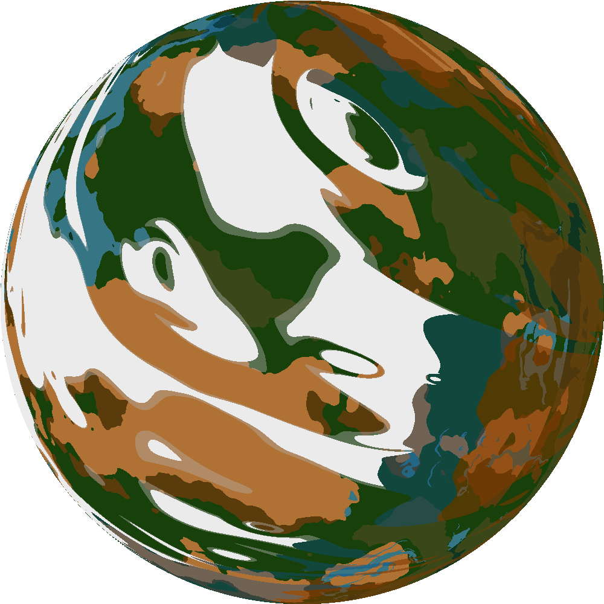
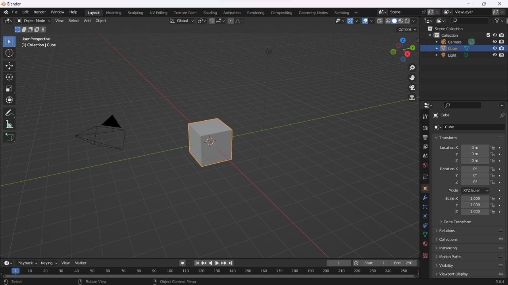
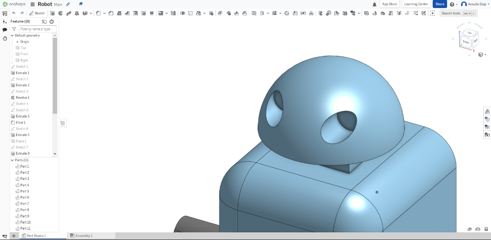
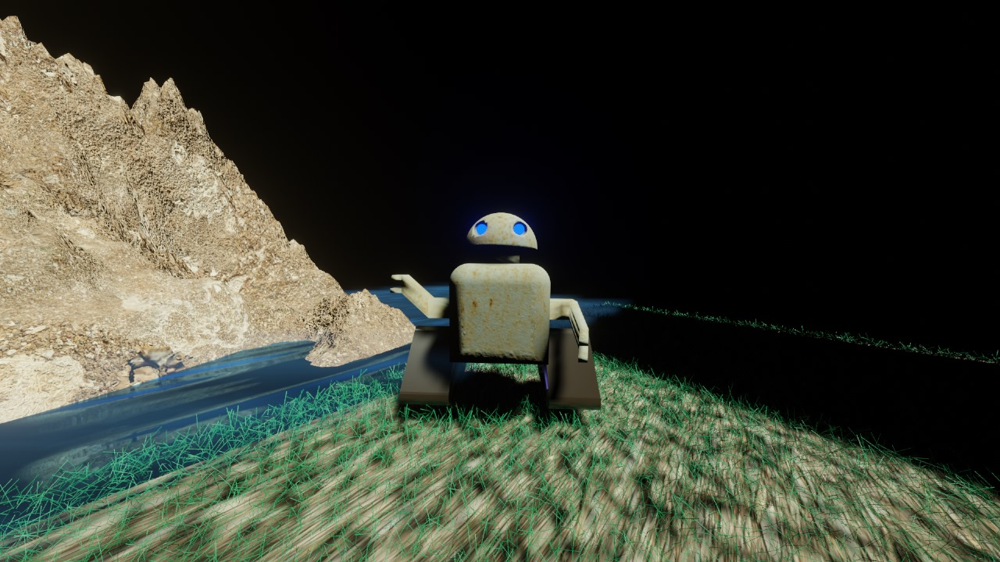
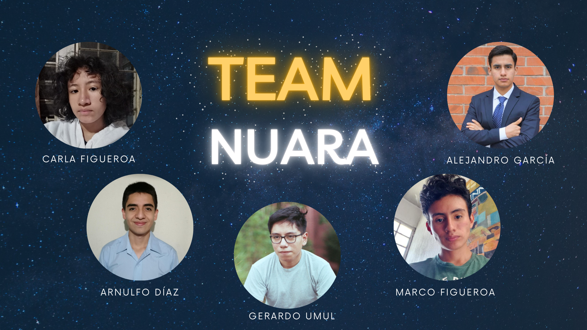

# Nuara  Nasa International Space Apps Challenge 2023 🌌

**Nuara** is a meticulously crafted video game tailored for individuals aged 12 and up. Our aim? To ignite a fervent passion for astronomy, astrophysics, and the boundless cosmic explorations.

> _"In this game, you're not just a player. You're the trailblazer, venturing into uncharted territories and unraveling the universe's mysteries. Let's go!"_

## Summary 📜
Life is too precious and since ancient times, humans have gazed up at the sky. Mesmerized by the stars and wondering about the secrets they hold. But what if we could not only observe these stars but also create worlds that orbit around them? With this in mind, we undertook the challenge of Habitable Exoplanets "Creating Worlds Beyond Our Own".

For this reason, we've developed an interactive and guided learning video game that showcases the designed exoplanet, Nuara. Inspired by NASA scientific data and with flashes of creativity. Nuara orbits in the habitable zone around the star Xibalbá, a K-dwarf, ideal for hosting life. 

What makes Nuara special is not only its position or size, but its atmosphere, rich in B-type chlorophyll, and its fascinating topography, with significant oceanic masses, reddish rocky landscapes and vast green areas, where life has flourished in ways we can barely imagine.

In addition, by exploring this world, a 3D modeling of the habitability of the exoplanet was made, showing the possibilities of life. In this sense, not only do we learn about the implications of exoplanets, but we learn about ourselves, about the ability to adapt, innovate and, above all, about the goal of dreaming for new worlds. The stories that could be told, the lessons that could be learned and the wonders to be discovered are extraordinary. Nuara is not just an exoplanet; it is a mirror, reflecting all the myriad possibilities the universe has to offer.

As a team, through this project, we aspire to be the next wave of scientists, explorers, and dreamers, propelling the vision that when we look up at the stars, we see them not just as distant dots in the sky but as destinations, awaiting our discovery.

---

## Project Demo 🚀
https://youtu.be/FPeIaX_4tKg

3D Model: https://youtu.be/po4gYgVk-ME

## Space Apps 2023 ☄
https://www.spaceappschallenge.org/2023/find-a-team/nuara/?tab=project

## Life in Nuara 👩‍🚀👨‍🚀
Nuara, an astral exoplanet in the Andromeda Galaxy, has captivated the imagination of interstellar explorers. A mere 2.5 light-years away from our home, this exoplanet promises a glimpse into an alternate reality of what life could be beyond our own blue planet. But what would life truly be like on Nuara? Let's embark on a journey of discovery.
The first sensation you'd feel as you step onto Nuara's surface would be the strong tug of gravity, a testament to its higher mineral concentration and dense core. This dense nature has another surprising benefit – vast underground aquifers that have formed over billions of years. Nuara's longer days and nights, a result of its 28-hour rotation, would require some adjustment. However, it would be nothing short of mesmerizing to witness the extended sunrises and sunsets, painting the sky in hues we might never have imagined.
Water, the elixir of life, is abundant here, but not just in the form we're accustomed to. Alongside vast, Earth-like oceans, Nuara boasts enormous liquid bodies of methane or ethane. These "lakes" and "seas" not only mirror the ethereal landscapes of Saturn's moon Titan but also harbor their own unique ecosystems, teeming with life forms waiting to be studied and understood.
The planet's topography is a diverse mosaic. The rust-orange rocky regions are a result of iron silicates reacting with oxygen, while phosphates, clays, and carbonates contribute to its varied, earthy tones. Nuara's vibrant green regions are particularly intriguing. With an atmosphere rich in chlorophyll type B, the vegetation here absorbs more green light, giving flora a unique appearance unlike anything on Earth.
The climate on Nuara is as varied as its landscape. Its 30-degree axial tilt leads to pronounced seasons, dictating the rhythm of life for its inhabitants. Organisms have evolved to withstand the intense sunlight of extended days and the chilling cold of prolonged nights. The flora is robust, with thick leaves and sturdy stems, while the fauna likely comprises extremophiles, resilient creatures that thrive in Nuara's unique conditions.
Beyond its physical characteristics, what makes Nuara truly special is its age. At 6 billion years old, it offers a vast timeline for evolution, much longer than Earth's. This extended history suggests a rich tapestry of life, with complex ecosystems that have had eons to diversify and adapt.
Living on Nuara would mean adapting to its rhythms and marveling at its unique biological wonders. The auroras at its poles, akin to Earth's Northern Lights, would be a spectacle to behold, a dance of lights illuminating the sky. And while the planet's mysteries would provide endless fascination, the robust magnetosphere ensures protection from harmful solar radiation, making it a safe haven for life.
In essence, life on Nuara would be both familiar and alien. Its landscapes might remind us of Earth's varied terrains, but its biological and atmospheric nuances would be a constant source of wonder. Nuara stands as a testament to the universe's boundless creativity, offering a world where the familiar meets the fantastic. It beckons us, inviting us to dream, explore, and, most importantly, to discover. For in Nuara, we see not just another planet, but a mirror reflecting the myriad possibilities that the universe has in store.
---

## Exoplanet: NUARA 🌠
The lush greens and deep blues suggest vast expanses of liquid water and thriving vegetation on the planet. In astrobiology, the presence of liquid water stands as a paramount indicator for potential life. Meanwhile, the rich oranges and browns pinpoint arid regions, deserts teeming with iron and essential minerals. Lastly, the wisps of white signal the presence of clouds or perhaps ice formations in Nuara's higher altitudes or polar regions. These cloud patterns play a pivotal role in climate regulation, reflecting sunlight and preserving heat.

These colors offer a window into not just its geographic and geologic facets but also its potential to harbor life. This positions Nuara as a beacon of interest in the realms of astrobiology and space exploration. Supported by robust scientific data, Nuara stands as a compelling contender for extraterrestrial habitability. Such insights, while teeming with technical depth, are presented to captivate and pique the reader's intrigue, ensuring they remain enthralled with the wonders of Nuara.

# Project Details 💡
**Nuara encapsulates our fervor for space, our thirst for knowledge, and our hope to inspire others to dream big.**
## What's its purpose?
Nuara is a project where we've crafted a video game tailored for individuals aged 12 and up, aiming to ignite a passion for astronomy, astrophysics, and various cosmic explorations. The game's mission is to provide players with a glimpse into life on a habitable exoplanet, sparking that innate human curiosity that's led to monumental achievements, such as landing on the Moon. In this game, you're the trailblazer, venturing into uncaharted territories and unraveling the universe's mysteries. Let's go! Nuara educates users about the features making our exoplanet habitable. This interactive learning occurs through the story mode, narrating the astronaut's arrival and adventures on Nuara, accompanied by explanations from the robot guide found on the planet. Players use keyboard arrows to navigate the exoplanet's map. 
## Benefits? ✅
- Interactive Education: As an educational video game, Nuara offers a stage for users to understand what an exoplanet is and delve deep into astrobiology, planetary habitability, and astronomy in an engaging manner.
- Stoking Scientific Curiosity: By letting users explore Nuara, we cultivate curiosity and kindle interest in space sciences.
- Tech Innovation: Integrating tools like Game Maker and Blender showcases a novel melding of tech to deliver top-tier user experiences.
- Promoting STEM careers: By presenting scientific concepts appealingly, we might inspire youth to ponder STEM careers.
- Collaboration & Community: Rooted in factual scientific data, there are avenues for collaborations with educational entities, observatories, and space enthusiasts.

## Coding platforms 💻
**-GameMaker:** Through this platform, the design and interactions of the exoplanet were developed using level editors and sprites. The educational components and interactive lessons were combined using the DnD or GML system, creating interactive learning modules on the habitability of the Nuara.

**-Blender**

**-OnShape**

---

---

---

---

---

## Exoplanet Design 🪐
The lush greens and deep blues suggest vast expanses of liquid water and thriving vegetation on the planet. In astrobiology, the presence of liquid water stands as a paramount indicator for potential life. Meanwhile, the rich oranges and browns pinpoint arid regions, deserts teeming with iron and essential minerals. Lastly, the wisps of white signal the presence of clouds or perhaps ice formations in Nuara's higher altitudes or polar regions. These cloud patterns play a pivotal role in climate regulation, reflecting sunlight and preserving heat.

These colors offer a window into not just its geographic and geologic facets but also its potential to harbor life. This positions Nuara as a beacon of interest in the realms of astrobiology and space exploration. Supported by robust scientific data, Nuara stands as a compelling contender for extraterrestrial habitability. Such insights, while teeming with technical depth, are presented to captivate and pique the reader's intrigue, ensuring they remain enthralled with the wonders of Nuara.

## NASA digital resources 🌕
-The Search For Life - Expoplanet Exploration: This resource provided invaluable insights into the quest for life on exoplanets and the definition of the "habitable zone." It was instrumental in determining the ideal conditions under which Nuara could support life, ensuring it resides within the habitable zone of its host star, Xibalbá (a K star).
-What is an Exoplanet? - Expoplanet Exploration: This tool assisted in defining and understanding what an exoplanet is. It shed light on how to detect them and the traits they might possess. It laid the foundational knowledge for Nuara's conceptual design.
-Machine Learning in the Search for Agnostic Biosignatures: Inspired by this source, the game incorporated the idea of using biochemical signatures to pinpoint life on Nuara and how cutting-edge tech, like machine learning, can aid in this pursuit.
-The Andromeda Galaxy - NASA's Goddard Space Flight Center: Though Nuara is situated in the Andromeda Galaxy, this asset offered both a visual and theoretical grasp of the galaxy, aiding in contextualizing the celestial environment wherein Nuara resides.--
-Exoplanet Exploration Planets Beyond Our Solar System: This NASA resource served as a general muse for the project, furnishing details about the spectrum of discovered exoplanets and their unique attributes.
-Canada's NIRISS reveals steamy atmosphere of distant planet: Leveraging this intel, Nuara's atmosphere was conceptualized, mulling over how exoplanetary atmospheres are detected and researched, and how these impact the prospects of life.
-La Magnetosfera: This NASA reference furnished insights on the magnetosphere's significance in shielding planets from harmful solar radiations. It was deployed to define and elucidate Nuara's robust magnetosphere and its contribution to its habitability.
-Exoplanets - The European Space Agency: Complementing NASA's data, this asset provided a more holistic perspective on exoplanets and their study. It shaped the overarching vision of the project and integrated international data and theories.
Through these resources, the Nuara project seamlessly blended accurate, real-world scientific data with gaming and interactivity elements, forging an educational yet captivating experience for users.

## Team 🌍

## References 🛰️
- [The Search For Life. Expoplanet Exploration](https://exoplanets.nasa.gov/search-for-life/habitable-zone/)
- [What is an Exoplanet?. Expoplanet Exploration](https://exoplanets.nasa.gov/what-is-an-exoplanet/overview/)
- [Machine Learning in the Search for Agnostic Biosignatures](https://astrobiology.nasa.gov/news/machine-learning-in-the-search-for-agnostic-biosignatures/)
- [The Andromeda Galaxy. NASA's Goddard Space Flight Center](https://svs.gsfc.nasa.gov/11675)
- [Exoplanet Exploration Planets Beyond Our Solar System](https://exoplanets.nasa.gov/alien-worlds/strange-new-worlds/)
- [Canada's NIRISS reveals steamy atmosphere of distant planet in detail](https://www.asc-csa.gc.ca/eng/news/articles/2022/20220712-canada-s-niriss-reveals-steamy-atmosphere-distant-planet-in-detail.asp)
- [La Magnetosfera](https://pwg.gsfc.nasa.gov/Education/Mms1.html)
- [Exoplanets. The European Space Agency](https://www.esa.int/Science_Exploration/Space_Science/Exoplanets)
 
 
 
Multimedia
This asset was leveraged to infuse our project with a stellar and immersive cosmic vibe.
-Unlike Pluto. (2020). Like Saturn - floating in an endless void [Royalty Free] [Video File]. Youtube. https://www.youtube.com/watch?v=C1fZUfx_FIQ
 
Images
These resources were instrumental in achieving a polished and appealing design, as well as enhancing the game's interactive interface and ambiance.
-Andrews, A. (2017). Luna llena durante el día [Photography]. Unsplash. https://unsplash.com/es/fotos/luna-llena-durante-el-dia-yOIT88xWkbg
-Cajina, I. (2017). Space. https://unsplash.com/es/fotos/asuyh-_ZX54 
-Deep-Fold [@Deep_Fold] (2023). Pixel-planet-generator. 
https://deep-fold.itch.io/pixel-planet-generator 
-Kosolapova, J. (2019). Acantilado marrón bajo el cielo blanco [Photography]. Unsplash. https://unsplash.com/es/fotos/tUsgCLx_HGk
-Pixel-boy [@2Pblog1] & Chazelles [@challenger.aaa]. (2023). Top down asset pack in a ninja theme, contains art, animations, fonts, SFX and musics. https://pixel-boy.itch.io/ninja-adventure-asset-pack
Snegos - Hits: 16987. (2023). Pixel Art More Text. https://textcraft.net/style/snegos/pixel-art

Logo
Custom logos for the project were crafted using the Canva platform. These logos serve as the visual identity for Nuara and can be viewed at the following links:
-https://www.canva.com/design/DAFwhWGm25E/8n99n0JMmsKUAg148FXgeQ/view
-https://www.canva.com/design/DAFwhI4M3zM/rv5beauXQzq8BozmSNlCZQ/view

